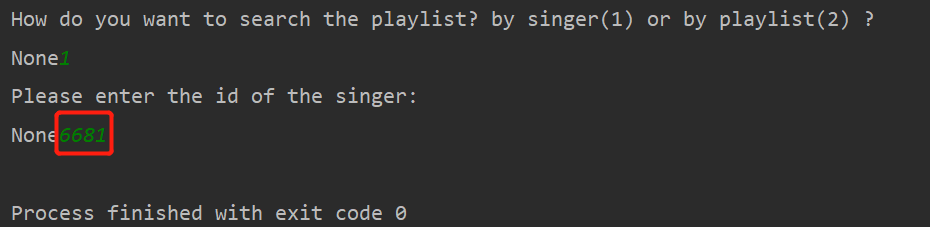
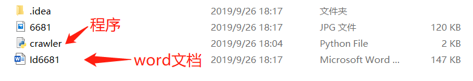
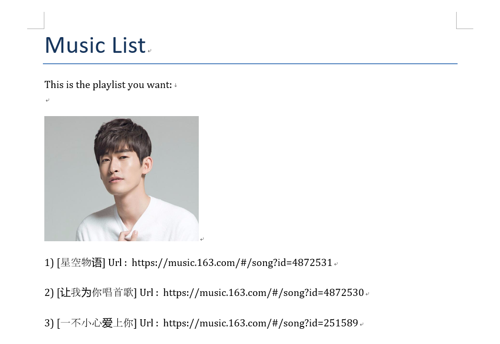
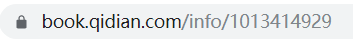

# Python 爬虫程序集
****

### 1. Netease music list
  
###### ID 为网址数字，若下图所示：  

  
###### 程序第二个输入口输入该ID

  
###### 程序所在目录下自动生成word文档

  
###### 文档内容如图所示：

  
**** 
### 2. Qidian novel download

###### ID 为网址数字，若下图所示：  

  
###### 程序第一个输入口输入该ID
  
###### 程序所在目录下自动生成txt文本，即小说文本
